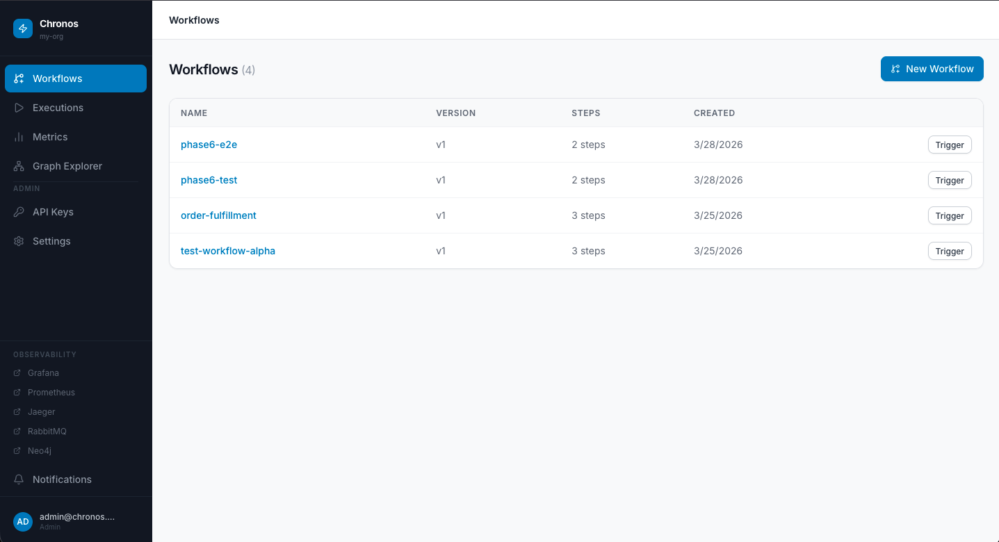
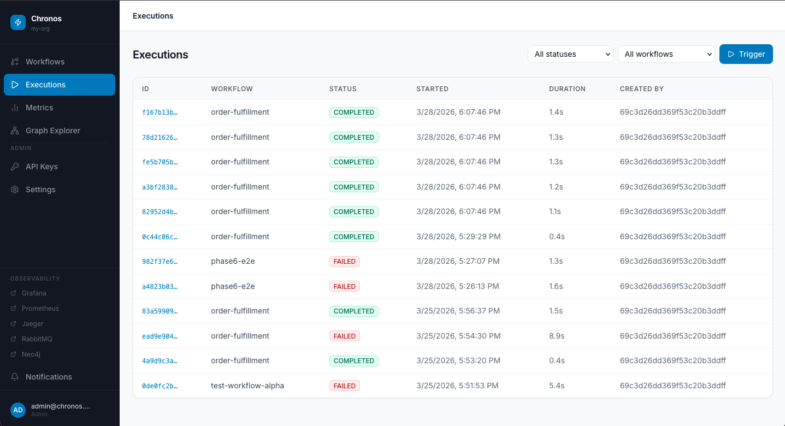
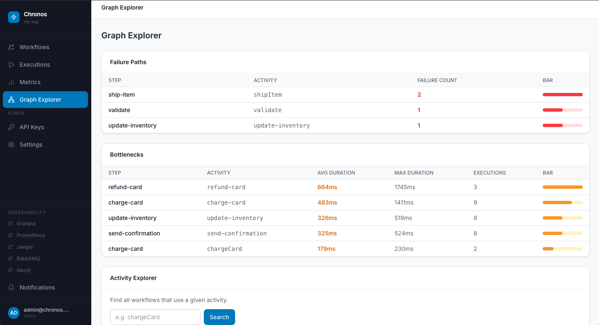
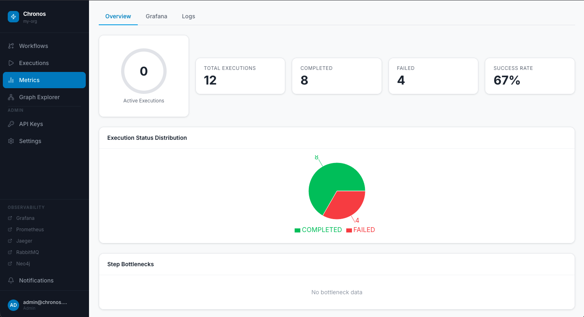
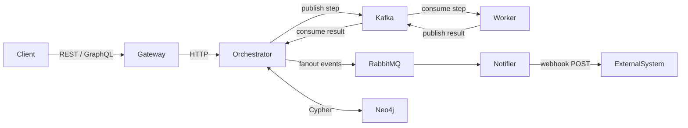

# Chronos

> Self-hostable workflow orchestration engine — open source alternative to AWS Step Functions and Temporal.io

[](https://github.com/gautamneeraj88/chronos/actions/workflows/ci.yml)
[](LICENSE)
[](https://github.com/gautamneeraj88/chronos/pkgs/container/chronos)

Chronos lets you define multi-step workflows with automatic retry, compensation (rollback), crash recovery, and distributed execution — all running in your own infrastructure.

---

## What it looks like

| Dashboard | Execution Timeline |
|-----------|-------------------|
|  |  |

| Graph Explorer | Grafana Metrics |
|----------------|----------------|
|  |  |

---

## Features

- **Saga pattern** — multi-step workflows with automatic compensation (rollback) on failure
- **Event sourcing** — append-only audit log, full execution history, crash-safe
- **Crash recovery** — restart mid-execution, resume from the exact step that was interrupted
- **Distributed workers** — scale horizontally; multiple workers consume from Kafka partitions
- **Retry + backoff** — configurable retries per step with exponential backoff
- **Timeout detection** — Redis TTL-based step timeout injection with dead letter queue
- **Dead letter queue** — unprocessable messages routed to `chronos.step.dlq` for inspection
- **GraphQL API** — queries, mutations, real-time subscriptions over SSE
- **Multi-tenancy** — org-scoped workflows and executions
- **API key management** — bcrypt-hashed keys with O(1) prefix lookup
- **Neo4j graph queries** — failure paths, bottlenecks, activity dependency analysis
- **Full observability** — Prometheus metrics, Grafana dashboards, Jaeger tracing, Loki logs
- **React dashboard** — JWT auth, role-based access (admin/member), live execution updates

---

## Quick Start

### Prerequisites

- Docker 24+ and Docker Compose v2, **or** Podman 4+ and podman-compose 1.1+

### One-command deploy

```bash
# 1. Download the compose file and example env
curl -O https://raw.githubusercontent.com/gautamneeraj88/chronos/main/docker-compose.prod.yml
curl -O https://raw.githubusercontent.com/gautamneeraj88/chronos/main/.env.example
cp .env.example .env
```

Edit `.env` — at minimum set these three:

```bash
JWT_SECRET=your-super-secret-key-at-least-32-chars
BOOTSTRAP_ADMIN_EMAIL=admin@example.com
BOOTSTRAP_ADMIN_PASSWORD=your-secure-password
```

Start everything:

```bash
docker compose -f docker-compose.prod.yml up -d
# or with Podman:
podman-compose -f docker-compose.prod.yml up -d
```

Open the dashboard: **http://localhost:8080**

Login with `BOOTSTRAP_ADMIN_EMAIL` / `BOOTSTRAP_ADMIN_PASSWORD`.

> First boot takes ~60 seconds while Kafka initialises topics and all services become healthy.

See [docs/quickstart.md](docs/quickstart.md) for the full step-by-step guide.

---

## Architecture

```
Client → API Gateway (REST/GraphQL) → Orchestrator → Kafka → Workers
                                            │
                                       RabbitMQ → Notifier (webhooks)
                                            │
                                          Neo4j (DAG queries)
```



See [docs/architecture.md](docs/architecture.md) for the deep dive on saga pattern, event sourcing, crash recovery, and distributed locking.

---

## vs AWS Step Functions / Temporal.io

| Feature | Chronos | AWS Step Functions | Temporal.io |
|---------|---------|-------------------|-------------|
| Self-hostable | ✅ | ❌ AWS only | ✅ complex setup |
| Open source | ✅ MIT | ❌ | ✅ MIT |
| One-command deploy | ✅ | ❌ | ❌ |
| Built-in dashboard | ✅ | ✅ AWS Console | ✅ |
| GraphQL API | ✅ | ❌ | ❌ |
| Neo4j DAG queries | ✅ | ❌ | ❌ |
| Grafana built-in | ✅ | ❌ | ❌ |
| Saga + compensation | ✅ | ✅ | ✅ |
| Crash recovery | ✅ | ✅ | ✅ |
| Horizontal worker scaling | ✅ Kafka partitions | ✅ | ✅ |
| Primary language | TypeScript / Node.js | JSON DSL | Go, Java, Python, TS |

---

## Services

| Service | Port | Description |
|---------|------|-------------|
| API Gateway | 3000 | REST + GraphQL entry point, JWT auth, rate limiting |
| Orchestrator | 3001 | Saga engine, event sourcing, crash recovery |
| Worker | 3002 | Kafka activity executor, horizontal scaling |
| Notifier | 3003 | RabbitMQ consumer, webhook delivery |
| Dashboard | 8080 | React frontend |

## Infrastructure

| Service | Port | Description |
|---------|------|-------------|
| MongoDB | 27017 | Workflow + execution storage |
| Redis | 6379 | Distributed locking, timeout tracking |
| Kafka | 9092 | Step execution message bus |
| RabbitMQ | 5672 / 15672 | Notification fanout |
| Neo4j | 7474 / 7687 | Workflow DAG graph queries |
| Jaeger | 16686 | Distributed tracing UI |
| Prometheus | 9090 | Metrics scraping |
| Grafana | 3004 | Dashboards and log explorer |
| Loki | 3100 | Log aggregation |

---

## Documentation

- [Quick Start](docs/quickstart.md) — deploy in 5 minutes
- [Architecture](docs/architecture.md) — saga, event sourcing, crash recovery, Kafka flow
- [API Reference](docs/api-reference.md) — all REST + GraphQL endpoints
- [Configuration](docs/configuration.md) — every env var for every service
- [Development Guide](docs/development.md) — local setup, testing, project structure
- [Deployment Guide](docs/deployment.md) — production checklist, scaling, reverse proxy, backups

---

## Contributing

See [CONTRIBUTING.md](CONTRIBUTING.md).

## Changelog

See [CHANGELOG.md](CHANGELOG.md).

## License

MIT — see [LICENSE](LICENSE).
