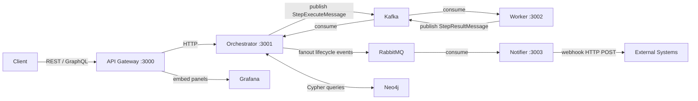
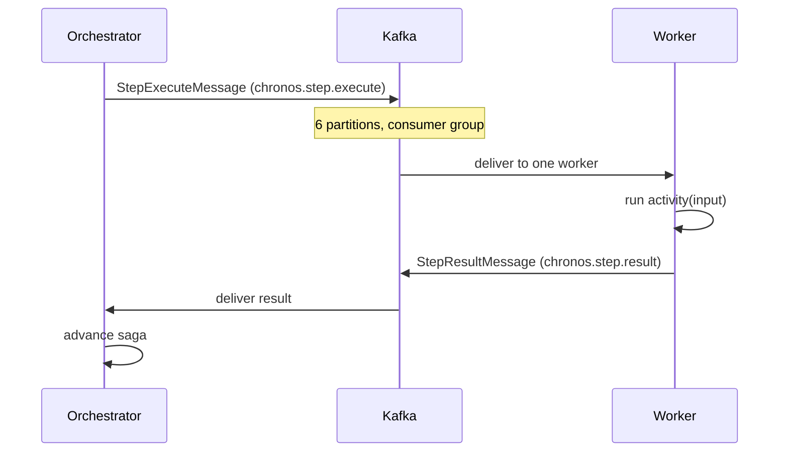
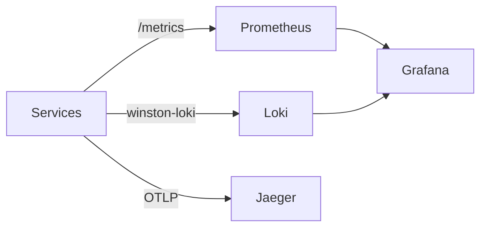

# Architecture

Chronos is a distributed workflow orchestration engine built on the **saga pattern** and **event sourcing**. This document explains the key design decisions and how all the pieces fit together.

---

## High-level overview



---

## 1. The Saga Pattern

**Problem:** Distributed transactions across multiple services. If step 2 succeeds but step 3 fails, we need to undo step 2 cleanly.

**Solution:** Each step in a workflow has an optional `compensation` — a reverse action that runs if the saga needs to roll back.

```
Forward execution:
  charge-card → update-inventory → send-confirmation
                                          ↑ fails here

Compensation (runs in reverse):
  restore-inventory ← refund-card
```

The `SagaEngine` in the orchestrator manages this state machine. On every step result it decides the next action:

| State | Condition | Next action |
|-------|-----------|-------------|
| Running | step succeeded, more steps remain | advance to next step |
| Running | step succeeded, no more steps | mark COMPLETED |
| Running | step failed, retries remain | retry the same step |
| Running | step failed, no retries | start compensation |
| Compensating | compensation succeeded, more compensations | advance to next compensation |
| Compensating | all compensations done | mark COMPENSATED |
| Compensating | compensation failed | mark COMPENSATION_FAILED (terminal) |

---

## 2. Event Sourcing

Every state change is an **immutable event** appended to MongoDB. Execution state is the result of replaying all events from the beginning.

```
EXECUTION_STARTED       { workflowId, input, triggeredBy }
STEP_STARTED            { stepId, activityName, attemptNumber }
STEP_IN_FLIGHT          { stepId }                    ← published to Kafka
STEP_COMPLETED          { stepId, output }             ← result from worker
STEP_STARTED            { stepId: next-step }
...
EXECUTION_COMPLETED     { output }
```

Benefits:
- **Full audit trail** — every decision is recorded
- **Time travel** — replay events to reconstruct any historical state
- **Crash recovery** — see section 3

The `EventRepository` uses MongoDB's append-only write pattern. Events are never updated or deleted.

---

## 3. Crash Recovery

If the orchestrator process crashes mid-execution:

```
Timeline:
  STEP_IN_FLIGHT written ← Kafka message published
  [CRASH — orchestrator dies here]
  [Restart]
  RecoveryEngine scans MongoDB for RUNNING/COMPENSATING executions
  Finds executions with STEP_IN_FLIGHT but no matching STEP_COMPLETED
  Re-publishes the in-flight step to Kafka
  Worker receives it (may be a duplicate — idempotency guard below)
  Execution resumes cleanly
```

The `STEP_IN_FLIGHT` event is the crash marker. It is written **before** the message is published to Kafka, so if the crash happens between writing and publishing, recovery will re-publish. If the crash happens after publishing, the worker may receive the message twice — the idempotency guard handles this.

**Idempotency guard:** The orchestrator checks whether a `STEP_COMPLETED` event already exists for the `(executionId, stepId, attemptNumber)` triple before processing a result. Duplicate results are silently dropped.

---

## 4. Kafka Message Flow



**StepExecuteMessage** (published to `chronos.step.execute`):
```typescript
{
  executionId: string;
  stepId: string;
  activityName: string;
  input: Record<string, unknown>;
  attemptNumber: number;
  retries: number;
  timeoutMs: number;
}
```

**StepResultMessage** (published to `chronos.step.result`):
```typescript
{
  executionId: string;
  stepId: string;
  success: boolean;
  output?: Record<string, unknown>;
  error?: string;
}
```

**Topics:**
- `chronos.step.execute` — 6 partitions, partitioned by `executionId`
- `chronos.step.result` — 6 partitions, partitioned by `executionId`
- `chronos.step.dlq` — 6 partitions, messages that exceeded max retries

Partitioning by `executionId` ensures all messages for a given execution are handled by the same consumer, preserving ordering within an execution.

---

## 5. Distributed Locking

When running multiple orchestrator instances, two instances could try to advance the same execution simultaneously. Chronos uses Redis to prevent this:

```
Acquire:  SET lock:{executionId} {lockId} NX EX 30
Process:  advance saga, write events, publish next step
Release:  Lua script — DEL lock:{executionId} only if value == {lockId}
```

The Lua atomic release prevents a race where:
1. Lock expires (TTL elapsed)
2. Instance B acquires the lock
3. Instance A tries to release — it must not release B's lock

`RedisLockService` handles this with a Lua script that checks ownership before deleting.

---

## 6. Retry and Timeout

**Retry with backoff:**
```
attempt 1 → fail → wait backoffMs
attempt 2 → fail → wait backoffMs * 2
attempt 3 → fail → wait backoffMs * 4
attempt N → fail → start compensation (if retries exhausted)
```

**Timeout detection:**
Each step has a `timeoutMs`. When the orchestrator publishes a step to Kafka, it also adds an entry to a Redis sorted set:

```
ZADD timeouts {deadline_unix_ms} {executionId}:{stepId}
```

A background ticker (`TimeoutScanner`) scans expired entries every second and injects a synthetic failure result — the same path as a real worker failure, triggering retries or compensation.

---

## 7. RabbitMQ Notification Fanout

The orchestrator publishes execution lifecycle events to a RabbitMQ **topic exchange** (`chronos.notifications`). The Notifier service consumes these and delivers webhook POSTs to registered URLs.

```
Exchange: chronos.notifications (topic)
Routing keys:
  execution.started
  execution.completed
  execution.compensated
  execution.failed
  step.completed
  step.failed
```

Each webhook registration specifies which events to subscribe to. The Notifier filters by routing key and signs the payload with HMAC-SHA256 using the webhook secret.

---

## 8. Multi-tenancy

Every resource (`WorkflowDefinition`, `Execution`, `ApiKey`, `Webhook`) has an `orgId` field. All MongoDB queries include `{ orgId }` in the filter. An organisation is identified by:

1. **JWT** — the `orgId` claim in the token (set at login time)
2. **API key** — the key record includes `orgId`, extracted on each request

The gateway extracts `orgId` from the verified token or API key and forwards it as `X-Org-Id` to the orchestrator. The orchestrator trusts this header (it is only reachable via the gateway on the internal network).

---

## 9. Neo4j Graph Model

The orchestrator maintains a parallel graph in Neo4j alongside the MongoDB event log:

```
(:Workflow {id, name, orgId})
  -[:HAS_STEP]->
(:Step {id, name, activityName})
  -[:NEXT]->
(:Step)

(:Execution {id, workflowId, status, orgId})
  -[:EXECUTED_STEP {startedAt, completedAt, durationMs, success}]->
(:Step)
```

Graph queries available at `/graph/*`:
- **Failure paths** — most common step failure sequences across all executions
- **Bottlenecks** — steps with the highest average execution time
- **Workflows by activity** — which workflows share an activity type
- **Execution graph** — full DAG for a single execution with timing
- **Activity dependencies** — which activities always run before others

---

## 10. Observability



- **Prometheus** — scrapes `/metrics` on gateway (:3000), orchestrator (:3001), worker (:3002) every 15s
- **Grafana** — 4 pre-provisioned dashboards: Execution Overview, Step Latency, DLQ depth, System
- **Loki** — receives structured JSON logs via `winston-loki` transport, queryable in Grafana Explore
- **Jaeger** — receives OTLP traces via `@opentelemetry/exporter-otlp-http`, traces span the full request lifecycle

---

## Package structure

```
packages/
  shared/       — types (WorkflowDefinition, Execution, ExecutionEvent),
                  errors (ValidationError, NotFoundError, UnauthorizedError),
                  logger (Winston with optional Loki transport)
  kafka/        — KafkaClient singleton, StepPublisher, ResultConsumer
  rabbitmq/     — RabbitMQClient, NotificationPublisher, NotificationConsumer
  neo4j/        — Neo4jClient singleton, WorkflowGraphService, GraphQueryService
  api-gateway/  — Express + GraphQL Yoga, JWT auth middleware, rate limiting
  orchestrator/ — SagaEngine, EventRepository, RecoveryEngine, RedisLockService,
                  TimeoutScanner, WorkflowRepository, ExecutionRepository,
                  AuthService, ApiKeyService
  worker/       — ActivityExecutor, KafkaConsumer/Publisher
  notifier/     — RabbitMQ consumer, WebhookDeliveryService
  dashboard/    — React + Vite + Tailwind + React Flow + GraphQL client
infra/
  prometheus/   — prometheus.yml + Dockerfile
  grafana/      — provisioning/ + grafana.ini + Dockerfile
  loki/         — loki-config.yaml
```
